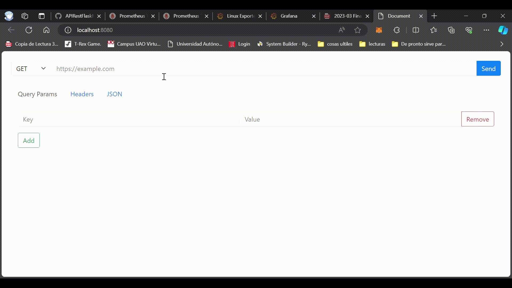

# HTTP Request Visualizer

This tool allows you to visualize HTTP requests and responses in a user-friendly interface. It provides a form to enter the request details, including the URL, method, query parameters, request headers, and request body. The tool then makes the request and displays the response, including the status code, response time, response size, response headers, and response body.

## Features

* **Easy to use:** The tool is designed to be easy to use, even for those who are not familiar with HTTP requests.
* **Visualize requests and responses:** The tool provides a visual representation of the request and response, making it easy to understand the flow of data.
* **Inspect response details:** The tool allows you to inspect the details of the response, including the status code, response time, response size, response headers, and response body.

## Local installation

 ```bash
npm i
```

Correr Cliente

 ```bash
npm run dev
```

<!-- ### Preview
<p aling="center">
         
</p>
   -->
From this client, you can now consume any REST API that with CORS. It's worth mentioning that you can consume APIs from a remote server, local server, or a virtual machine.

The endpoints typically follow this style:

Endpoints:

 ```bash
http://192.168.60.3:5000/books | http:<MACHINE IP>:<PORT>/<ROUTE>
```

```bash
http://192.168.60.3:5000/books/:id | http:<MACHINE IP>:<PORT>/<ROUTE>/:id
```

```bash
https://jsonplaceholder.typicode.com/todos/4
```
